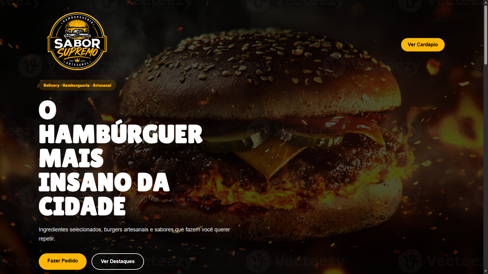
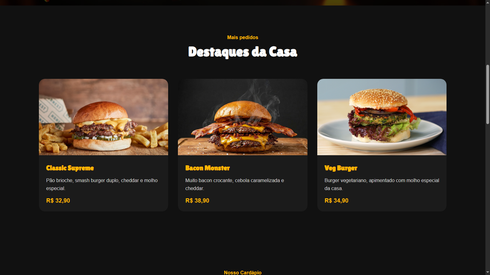
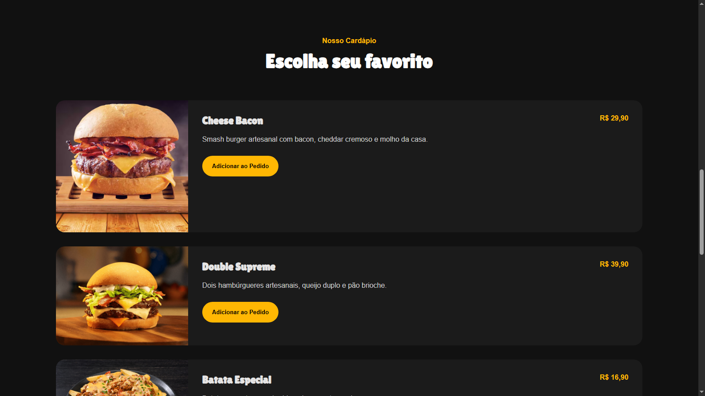
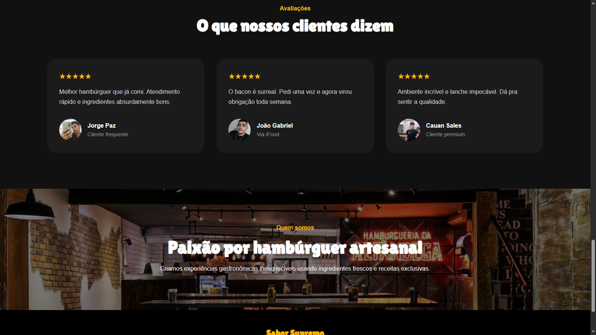
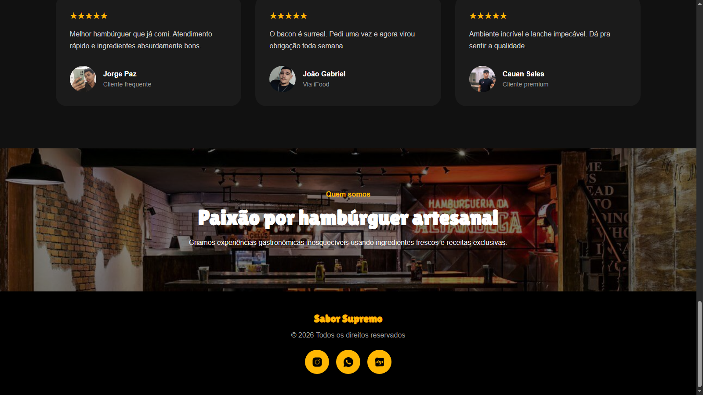

# 🍔 Sabor Supremo

Landing Page moderna e responsiva para uma hamburgueria artesanal fictícia chamada **Sabor Supremo**.

O projeto foi desenvolvido com foco em design moderno, experiência do usuário, responsividade e interações suaves utilizando apenas HTML, CSS e JavaScript puro.

---

# 📸 Preview








---

# ✨ Funcionalidades

- Hero section moderna e chamativa
- Cards de destaque interativos
- Sistema de expansão dos burgers ao clicar
- Overlay escurecendo o fundo ao abrir um card
- Animações suaves ao scroll
- Sessão de avaliações de clientes
- Layout totalmente responsivo
- Hover effects
- Background com overlay escurecido
- Footer com redes sociais
- Favicon personalizado
- Meta tags Open Graph para compartilhamento

---

# 🛠️ Tecnologias utilizadas

- HTML5
- CSS3
- JavaScript Vanilla

---

# 📱 Responsividade

O projeto foi adaptado para:

- Desktop
- Tablets
- Smartphones

Incluindo ajustes específicos para telas menores como:

- Redimensionamento dos cards ativos
- Ajuste de textos e botões
- Melhor experiência mobile

---

# 🎨 Design

O visual foi inspirado em landing pages modernas de hamburguerias premium utilizando:

- Tons escuros
- Destaques em amarelo (`#ffb703`)
- Tipografia forte
- Efeitos de glow
- Layout limpo e moderno

---

# ⚡ Interações

## Cards expansíveis

Ao clicar em um burger da seção de destaques:

- o card é movido para o centro da tela
- o fundo da página escurece
- apenas um card pode ficar aberto por vez
- clicar novamente fecha o card

---

## Animações de scroll

Elementos com a classe `.pop` surgem suavemente conforme aparecem na tela utilizando:

```js
IntersectionObserver
```

---

# 📂 Estrutura do projeto

```bash
📦 sabor-supremo
 ┣ 📂 assets
 ┃ ┣ 📂 fonts
 ┃ ┣ 📜 bacon.png
 ┃ ┣ 📜 batata.png
 ┃ ┣ 📜 borger.png
 ┃ ┣ 📜 cheeseBacon.png
 ┃ ┣ 📜 cliente1.png
 ┃ ┣ 📜 cliente2.png
 ┃ ┣ 📜 cliente3.png
 ┃ ┣ 📜 doubleSupreme.png
 ┃ ┣ 📜 logo.png
 ┃ ┣ 📜 veg.png
 ┃ ┗ 📜 about.png
 ┣ 📜 index.html
 ┣ 📜 style.css
 ┣ 📜 modal.js
 ┣ 📜 pop.js
 ┗ 📜 README.md
```

---

# 🚀 Como executar

Clone o projeto:

```bash
git clone https://github.com/richter06/CardapioDigital.git
```

Depois basta abrir o `index.html` no navegador.

Recomendado utilizar a extensão **Live Server** no VS Code (ou parecidas).

---

# 👨‍💻 Autor

Desenvolvido por **Richard R. Araújo**
